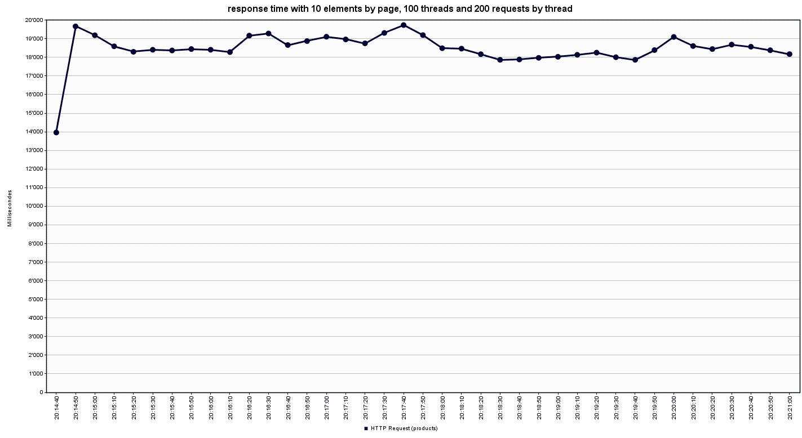
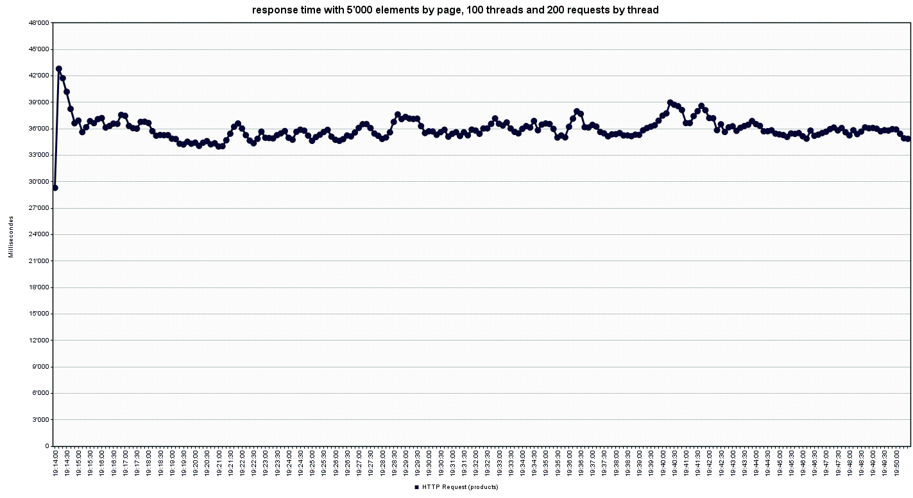

# Teaching-HEIGVD-AMT-2019-Project-One

## Objectives

The main objective of this project is to apply the patterns and techniques presented during the lectures, and to create a simple multi-tiered application in Java EE.

## The Black Market

Our application is called **The Black Market**, it is a simplified online shop (extremely simplified)
that is accessible by creating an account on it. After you are logged in you can start browsing through a
set of *fake products*, and them to your shopping cart and order (or cancel) them. Nothing to pay, but you wont get them anyway ;)

You can take a look at your account and see your order history. There you have the possibility to delete your account or
go on the **Account Edition page** to change your **email** or your **password**.

When you find a product look closer at some of the products you can click on the **see product** link and
it will show you the specific product on a new page with some more information and an image.

Don't forget to check our 404 custom page ;)

## Pre-requisites

we consider you have install correctly install all of this programs:
 - [node](https://nodejs.org/en/download/)
 - [docker & docker-compose](https://www.docker.com/get-started)

## Recommended

 - [git](https://www.atlassian.com/git/tutorials/install-git) (This way you can *pull* the project instead of downloading it)
 - An **internet connection** when using the application. We are using some CDNs to make our pages looking nice and
 the images of our products are also taken from a remote site. If you are offline it will be pretty sad.

## Installation

Download or *pull* the project.

### Configuration

If you only want to launch the application there is nothing much to do and you can skip to the **Run project** part.
But if you want to launch the test suite you will need to configure the `arquillian.xml` file in `src/test/resources/arquillian.xml` 
with either `localhost` or `<your docker-machine ip>` in the following places according to your installation.

```xml
<property name="managementAddress">localhost</property>
```

```xml
<property name="host">localhost</property>
```


## Run app

All the executables are in the `launcher` folder.

First, generate the sample data by executing the `launcher/gen-data.sh` file. (you only need to do that once ! It takes some time...)
```bash
# from the project root folder
./launcher/gen-data.sh
```

Now you can build and lauch the app by executing the `launcher/launch-app.sh` file.
```bash
# from the project root folder
./launcher/launch-app.sh
```

To access the application, open a browser and go on the following link (change localhost by your docker-machine address if you use one)

[http://localhost:8080/AMT-project-01](http://localhost:8080/AMT-project-01)

## Run the tests suite

To run the tests suite you will first need to start the *test* dockers.
```bash
# from the project root folder
./launcher/start-test-dockers.sh
```
Now you can start the tests (in another terminal)
```bash
# from the project root folder
./launcher/run-tests.sh
```

## Troubleshooting

- `port already use` or` not enouth space`

    run this command in a terminal when the daemon docker is started 
    ```shell
    # kill all running docker (can avoid port already use) : 
    $ docker kill $(docker ps -q)
    # remove images (can avoid not enouth space):
    $ docker images -aq -f 'dangling=true' | xargs docker rmi
    # remove volumes (can avoid not enouth space):
    $ docker volume ls -q -f 'dangling=true' | xargs docker volume rm
    ```
    for the two last command you can use with caution --force
    
- Error while launching the tests suite

   Make sure you have set your `arquillian.xml` with *localhost* or with your **docker-machine** address.

- Launching `launch-app.sh` fails with `not found (Errcode: 2 - No such file or directory)`

  Make sure you generated the sample data first (at least once). 
  
  See [**Run App**](#run-app)
  

## Some additional information

### Sample data generation

Our sample data is generated using the **Change module** from **npm**, it has a fixed seed (42) so that it always generates the same data set.

The data consists of:

- 50'000 clients
- 1'000'000 products
- 74'998 orders
- 224'560 orderlines

## JMeter results

We try to quantify the impact of using pagination for products servlet. We use Jmeter for simulate 100 users connection and each of them do 200 requests to the servlet. 

We start with 10 elements by pages, we obtains the next graph.

```

Nous tentons grâce à Jmeter de quantifier l’impact de l’utilisation d’une pagination sur notre page /shop/products. Pour ce faire nous utilisons Jmeter pour que 100 Utilisateurs (représenter par des threads) se connecte sur le site via /login. Nous désactivons volontairement le suivit de la redirection car cette redirection ne fait pas partie de notre test. Puis nous effectuons 200 requêtes GET sur /shop/produit. 
 Nous commençons avec une pagination à 10 éléments par page, et obtenons le graphique suivant :  

```



```
On peu voir que le temps de réponses varie entre 17'000 et 20'000 millisecondes sans jamais les dépasser 
```

 We can see that the response time stay between 17'000 and 20'000 millisecond. 



```
Nous augmentons ensuite la pagination à 5'000 éléments et relançons les tests et obtenons le graphique suivant 
```

 we augment the number of element by page at 5'000 and relauch the test. we obtains the next graph: 


```
On voit que cette fois si le temps de réponse varie entre 33'000 et 39'000 (après stabilisation).
```

 We see the response time go up between 33'000 and 39'000

When we try to put more elements into each pages we obtains error cause of buffer size or java Vm memory capacity. we don't invistigate more cause we known what's going on. 

We know that more we puts elements into the pages the more response time we got. But we don't forget that if we use one element by page the user will use more request for acces to the good element and he can be frustrated to have to click 20 times to next, we choose to use 10 elements by page for combine the response time, the UI and the user's experience. 

```
Nous arrêtons nos tests ici car avec plus d’éléments par page soit les buffers de notre serveur ne sont pas assez grand soit jmeter nous retourne une erreur java (aussi lier à la taille en mémoire). Nous n’investiguons pas plus car il est évident que déjà avec 5'000 éléments par page la différence en termes de temps de réponse est déjà suffisamment significative pour dire que plus ont met d’élément sur la page plus le temps de réponse augmente. 

 Bien sur ils ne faut pas oublier que si on ne met qu’un élément par page un utilisateur fera plus de requête car il changera plus de page pour accéder à la ressource désirer. C’est pour ça que nous avons choisi 10 éléments par page qui semblent un bon compromis entre les temps de réponse, l’interface utilisateur et le confort d’utilisation. 
```

## Known bugs

// TODO

## Features that could be improved (with additional time)

- It is actually not possible to create a product using the app, only manually adding it to the database. (we could make an additional page to let the client add a product, The DOAs have the methods ready for that.)
- It is not possible to buy a product directly from the page of the product (we could add a button and servlet logic to add it to the current shopping cart, it doesn't need a lot of changes)

